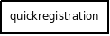

Moduler
=======

For at gøre Selvbetjening velgnet til flere forskellige foreninger tilstræbes der et meget modulært system. Alt funktionalitet samles i moduler med specifikke formål og dokumenterede afhængigheder af hinanden.

Following is a overview of modules.

quickregistration
  Dette modul står for registreringen af nye brugere. Modulet er målrettet en meget simpel og hurtig registrering uden brug af email validering e.l.
