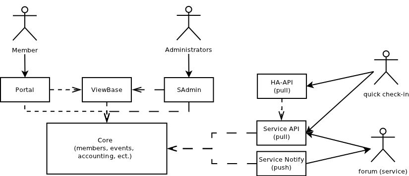

========
Oversigt
========

Selvbetjening er opdelt i fire forskellige typer moduler; core, data, clients og viewhelpers.

 Core moduler::
  Core moduler indeholder centrale funktioner for selvbetjening som bruges af alle andre moduler.
 Data moduler::
  Data modulerne definerer informationer som er centrale for selvbetjening, og som derfor antages er tilgængelige for alle installationer (og derfor er disse moduler derfor altid installeret).
 Client moduler::
  Client modulerne står for manipulation af data modulerne samt defineringen af yderlige data. Disse er anset for at være valgfrie, så man må ikke antage at et client modul er installeret.
 Viewhelpers::
  Indeholder hjælper funktioner som ikke er centrale for selvbetjening og er målrettet rendering af elementer på siden.

Ud over disse tre typer moduler så definere hvert modul de nødvendige stukturer brugt af Djangos administrations interface. Derved kan alle brugte moduler i en installation administreres af dette samlet interface.
