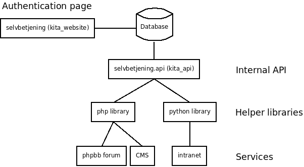
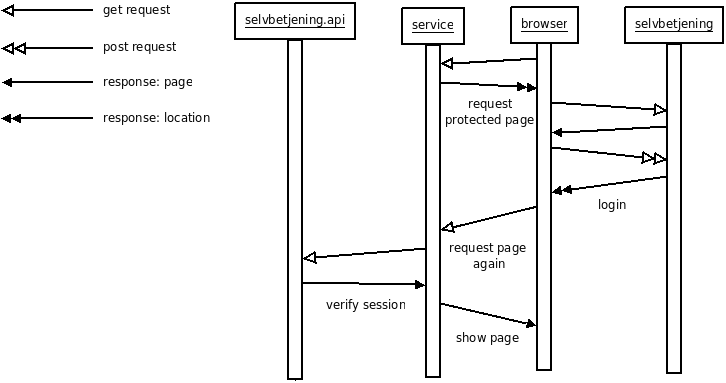

==============
Single Sign-On
==============

Målet er at implementere single sign-on (SSO) i services såsom forummet og intranettet. SSO implementationen består af tre dele.

 Authentication Page::
  Selvbetjening bruges som den centrale log ind side. Ved at logge ind på selvbetjening vil man derefter automatisk kunne tilgå alle andre services. Når en bruger logger ind gemmes der en kita_auth_token i brugerens cookies. Denne kan derefer tilgås af vores services.
 Service::
  De forskellige services vi vil integrere med SSO. Der stilles kode biblioteker til rådighed for at integrere de forskellige services lettere.
 Internt API::
  Den interne API er en separat proces der via. HTTP tilbyder en simpel API til verificering af sessions. Denne API er kun tilgængelig for de enkelte services.

Ideen er således, at de enkelte services kan sende en bruger videre til selvbetjening hvis denne ikke er logget ind. Hvis brugeren siger han er logged ind, kan dette verificeres igennem den interne API (for at undgå snyd ved manipulering af cookies).

Følgende viser fremgangsmåden ved en ikke authenticated bruger der besøger en beskyttet side.

