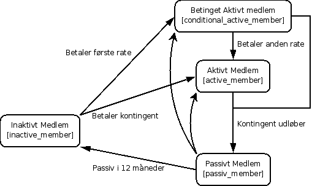

******************
Accounting Modulet
******************

Beskrivelse
===========

Accounting modulet bruges til at administrere betalinger udført af brugere samt beregne deres medlemsstatus.

Design
======

Bruger state
------------

Udtrykket bruger (user) bruges som en betegnelse for personer som har brugernavn og kodeord til selvbetjening, og derved en bruger. Medlem (member) bruges som betegnelse for personer som er medlemmer af foreningen. Der er tre delgrupper af medlemmer, hvoraf alle brugere tilhører en af disse delgrupper.

Medlemmer deles op i delgrupperne:

Aktive medlemmer
   Medlemmer der har betalt kontingent.
Passive medlemmer
   Medlemmer hvis kontingent er udløbet (efter 4 kvartaler), men stadig regnes med som medlem i opgørelser af medlemstal. Denne status bliver droppet efter yderligere 4 kvartaler.
Inaktive medlemmer
   Medlemmer der ikke har betalt kontingent, eller tidligere passive medlemmer. Disse kan ikke deltage i arrangementer før de betaler kontingent og regnes ikke med i medlemstal.

