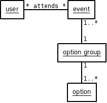

**************
Events Modulet
**************

Analyse
=======

System Definition
-----------------

Events indeholder modeller, views, forms og administrations sider der er målrettet administration og brug af arrangementer for en forening. Arrangementerne kan oprettes og overvåges fra admin siden. Brugere på siden har dertil mulighed for at tilmelde sig arrangementer 

Til et arrangement kan der defineres en række tilvalg en bruger kan tage når hun tilmelder sig et arrangement. 

Problem Området
---------------

Følgende figur viser de klasser der bliver behandlet i events modulet.

Anvendelses Området
-------------------

Der er to aktører i dette modul. En administrator skal være i stand til at oprette og administrere arrangementer, mens brugere skal være i stand til at tilmelde sig arrangementer og vælge tilvalg. Administratoren bruger admin interfacet mens den almene bruger benytter sig af af den offentlgie side.

